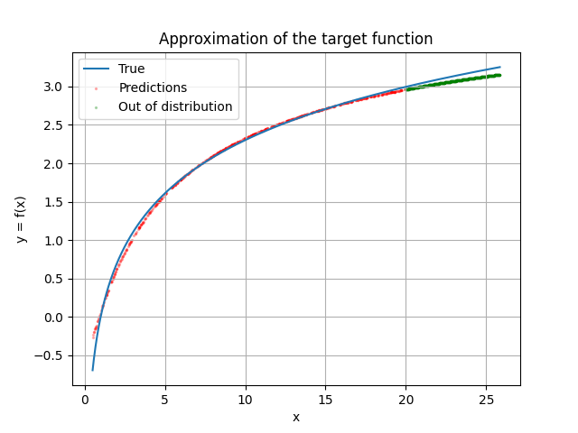

# Constrained Monotonic Neural Networks
Implementation of MonoDense in PyTorch, renamed MonoLinear. This Python library implements Constrained Monotonic Neural Networks as described in:

Davor Runje, Sharath M. Shankaranarayana, “Constrained Monotonic Neural Networks”, in Proceedings of the 40th International Conference on Machine Learning, 2023. [PDF](https://arxiv.org/pdf/2205.11775).

# Examples

## Data-driven approximation of the natural logarithm

### Code

The toy example in `toy_run.py` tries to approximate the natural logarithm $x \mapsto \ln(x)$ from noised data points with a concave increasing function. An example of run:
```bash
python toy_run.py --n_epochs 1500 --n_layers 2 --decay 0.01 --hidden_dim 32 --concave
```

### Setup
Data points $\mathcal{D} = \left( \left(X_i, Y_i\right)\right)_{1 \leq i \leq n}$ are independent and identically distributed and constructed using the following method. For all $i \in \{1, \ldots, n\}$, with $\sigma = 0.05$,

$$
X_i \underset{\text{i.i.d.}}{\sim} \text{Uniform}(0.5, 20) \\

\varepsilon_i \underset{\text{i.i.d.}}{\sim} \mathcal{N}(0, \sigma^2)\\

Y_i = \ln(X_i) + \varepsilon_i
$$

The model consists of stacked `MonoLinear` layers with an ELU base activation, except for the last layer. The monotonicity indicator of all layers is 1 by default.

Since $\ln$ is strictly concave on $\mathbb{R}_+^{\ast}$, we enable the `is_concave` flag to facilitate the learning process.

### Results

The following figure shows the prediction of the model on the test set. The model is able to approximate the natural logarithm with a high degree of accuracy, even on out-of-distribution samples where it preserves concavity.

<p align="center">
  
</p>

## Heart Disease Dataset

### Code

The example in `heart_disease_run.py` uses the Heart Disease dataset from the UCI Machine Learning Repository. An example of run:
```bash
python run.py --n_epochs 200 --n_layers 2 --decay 0.05 --hidden_dim 16
```

### Results

I obtained the following results after running the code:

| | Precision | Recall | F1-score | Support |
| --- | --- | --- | --- | --- |
| Class 0 | 0.90 | 0.94 | 0.92 | 48 |
| Class 1 | 0.73 | 0.62 | 0.67 | 13 |
| Macro avg | 0.81 | 0.78 | 0.79 | 61 |
| Weighted avg | 0.86 | 0.87 | 0.86 | 61 |

The test accuracy I obtained is 0.87.

## Citation

The original paper can be found [here](https://arxiv.org/pdf/2205.11775):
```bibtex
@inproceedings{runje2023,
  title={Constrained Monotonic Neural Networks},
  author={Davor Runje and Sharath M. Shankaranarayana},
  booktitle={Proceedings of the 40th {International Conference on Machine Learning}},
  year={2023}
}
```